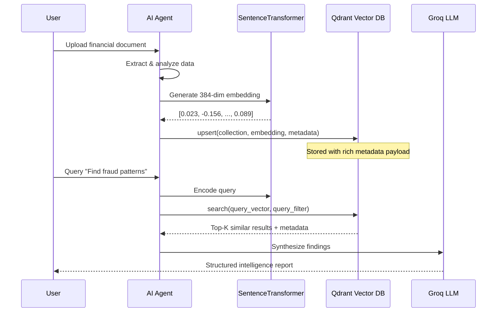

<div align="center">

# 🔱 Trinetra — Agentic Credit Intelligence OS

### *14 AI Agents × 14 Qdrant Collections = Automated Credit Underwriting in 60 Seconds*

[](https://qdrant.tech/)
[]()
[]()
[]()
[]()
[]()
[]()
[]()

---

*Trinetra is an agentic AI platform that automates the entire commercial credit underwriting lifecycle — from document ingestion to a professional 10-page Credit Appraisal Memorandum (CAM) — powered by **Qdrant Vector DB** as the central intelligence layer.*

</div>

---

## 📑 Table of Contents

- [The Problem](#-the-problem)
- [The Solution](#-the-solution)
- [System Architecture](#-system-architecture)
- [How We Use Qdrant](#-how-we-use-qdrant--the-heart-of-trinetra)
- [The 14 AI Agents](#-the-14-ai-agents)
- [Qdrant SDK Features Used](#-qdrant-sdk-features-used)
- [Tech Stack](#-tech-stack)
- [Quick Start](#-quick-start)
- [Project Structure](#-project-structure)
- [API Endpoints](#-api-endpoints)
- [Key Features](#-key-features)
- [Demo](#-demo)
- [Team](#-team)

---

## 🔴 The Problem

India's **₹152 trillion credit market** still relies on manual underwriting. A single commercial loan application requires a credit analyst to:

- Manually review **10+ financial documents** (ITR, GST returns, bank statements, annual reports)
- Cross-verify data across **MCA**, **PAN**, **GSTN**, and **RBI** databases
- Assess risk through subjective judgment with **no standardized scoring**
- Produce a **10-page Credit Appraisal Memorandum** — taking **3-5 business days**

> **Result**: High NPAs (₹5.7 lakh crore in 2025), inconsistent decisions, and massive operational bottlenecks.

---

## 🟢 The Solution

**Trinetra** automates the entire pipeline:

```
Upload Documents → 14 AI Agents Activate in Parallel → Qdrant Stores Intelligence
→ Risk Scored with Explainable AI → 10-Page CAM Report Generated → Decision in 60 Seconds
```

Every piece of intelligence — financial profiles, fraud patterns, litigation records, risk decisions — is **embedded and stored in Qdrant Vector DB**, creating a searchable institutional memory that grows smarter with every application.

---

## 🏗️ System Architecture


```mermaid
graph TB
    subgraph "Frontend - React + Vite"
        UI[🖥️ Trinetra Dashboard]
        VE[🔍 Qdrant Explorer]
        AT[💬 Ask Trinetra]
    end

    subgraph "Backend - FastAPI"
        API[⚡ FastAPI Server :8000]
        WS[🔌 WebSocket Manager]
        RB[📡 Redis Pub/Sub Broker]
        SA[💾 Local Storage Adapter]
    end

    subgraph "Qdrant Vector DB - HTTP :6333"
        direction LR
        C1[📄 document_chunks]
        C2[💰 financial_profiles]
        C3[📊 gst_patterns]
        C4[🏦 bank_recon_profiles]
        C5[📰 news_articles]
        C6[⚖️ litigation_records]
        C7[🏛️ rbi_circulars]
        C8[🏢 mca_filings]
        C9[🆔 pan_profiles]
        C10[⚠️ risk_decisions]
        C11[🎤 pd_transcripts]
        C12[📈 stress_scenarios]
        C13[🔍 audit_events]
        C14[📋 application_summaries]
    end

    subgraph "14 AI Agents"
        A1[📋 compliance-agent]
        A2[📄 doc-agent]
        A3[📊 gst-agent]
        A4[🏦 bank-recon-agent]
        A5[🏢 mca-agent]
        A6[🌐 web-agent]
        A7[🆔 pan-agent]
        A8[🤖 model-selector-agent]
        A9[⚠️ risk-agent]
        A10[⚖️ bias-agent]
        A11[📈 stress-agent]
        A12[🎤 pd-agent]
        A13[📝 cam-agent]
        A14[👁️ monitor-agent]
    end

    UI --> API
    VE --> API
    AT --> API
    API --> SA
    API --> RB
    RB --> WS
    WS --> UI
    SA --> C1
    A1 & A2 & A3 & A4 & A5 & A6 & A7 --> C1 & C2 & C3 & C4 & C5 & C6 & C7 & C8 & C9
    A8 & A9 & A10 & A11 & A12 & A13 & A14 --> C10 & C11 & C12 & C13 & C14
    A1 & A2 & A3 & A4 & A5 & A6 & A7 & A8 & A9 & A10 & A11 & A12 & A13 & A14 --> API

    style C1 fill:#1a1a2e,stroke:#00d4ff,color:#fff
    style C2 fill:#1a1a2e,stroke:#00d4ff,color:#fff
    style C3 fill:#1a1a2e,stroke:#00d4ff,color:#fff
    style C4 fill:#1a1a2e,stroke:#00d4ff,color:#fff
    style C5 fill:#1a1a2e,stroke:#00d4ff,color:#fff
    style C6 fill:#1a1a2e,stroke:#00d4ff,color:#fff
    style C7 fill:#1a1a2e,stroke:#00d4ff,color:#fff
    style C8 fill:#1a1a2e,stroke:#00d4ff,color:#fff
    style C9 fill:#1a1a2e,stroke:#00d4ff,color:#fff
    style C10 fill:#1a1a2e,stroke:#00d4ff,color:#fff
    style C11 fill:#1a1a2e,stroke:#00d4ff,color:#fff
    style C12 fill:#1a1a2e,stroke:#00d4ff,color:#fff
    style C13 fill:#1a1a2e,stroke:#00d4ff,color:#fff
    style C14 fill:#1a1a2e,stroke:#00d4ff,color:#fff
```

---

## 🗄️ How We Use Qdrant — The Heart of Trinetra

**Qdrant is not just a component — it IS Trinetra's brain.** Every agent reads from and writes to Qdrant, creating a living knowledge graph of financial intelligence.

### Why We Chose Qdrant

| Requirement | Why Qdrant |
|---|---|
| **Bank-grade data privacy** | Runs **100% locally** via Docker — no data leaves the machine. Critical for financial PII. |
| **Low-latency search** | HTTP protocol delivers **sub-50ms** semantic search across 14 collections |
| **Hybrid search** | Native payload filtering combines vector similarity + metadata key/value filters in a single query |
| **Edge deployment** | Portable, lightweight — the entire Trinetra OS runs on a **single Mac** |
| **No cloud dependency** | Zero external API calls for storage/search. Fully **offline-capable**. |
| **Multi-collection architecture** | First-class support for **14 isolated collections** with independent schemas |

### The 14 Qdrant Collections

Every collection uses **384-dimensional embeddings** via `all-MiniLM-L6-v2` with **Cosine distance**.

| # | Collection | Owner Agent | What It Stores | Qdrant Operations |
|:---:|---|---|---|---|
| 1 | `document_chunks` | doc-agent | OCR-extracted text chunks from financial PDFs | `upsert`, `search` |
| 2 | `financial_profiles` | doc-agent | Derived financial ratios (DSCR, leverage, revenue) | `upsert`, `search` |
| 3 | `gst_patterns` | gst-agent | GST discrepancy patterns & circular trading flags | `upsert`, `search` |
| 4 | `bank_recon_profiles` | bank-recon-agent | Bank statement vs GST turnover reconciliation | `upsert`, `search` |
| 5 | `news_articles` | web-agent | Sentiment-scored news from RAG pipeline | `upsert`, `search` |
| 6 | `litigation_records` | web-agent | Court cases, NCLT filings, legal disputes | `upsert`, `search` |
| 7 | `rbi_circulars` | web-agent | RBI regulatory circulars & sector headwinds | `upsert`, `search` |
| 8 | `mca_filings` | mca-agent | MCA21 corporate filings, charges, director data | `upsert`, `search` |
| 9 | `pan_profiles` | pan-agent | PAN verification & KYC intelligence | `upsert`, `search` |
| 10 | `risk_decisions` | risk-agent | ML risk scores with SHAP explainability | `upsert`, `search` |
| 11 | `pd_transcripts` | pd-agent | Personal discussion transcripts & sentiment | `upsert`, `search` |
| 12 | `stress_scenarios` | stress-agent | DSCR stress test results under rate/revenue shocks | `upsert`, `search` |
| 13 | `audit_events` | monitor-agent | Pipeline health, drift detection, heartbeats | `upsert`, `search` |
| 14 | `application_summaries` | all agents | Cross-agent merged application intelligence | `upsert`, `search` |

### How Data Flows Through Qdrant


```mermaid
sequenceDiagram
    participant User
    participant Agent as AI Agent
    participant Embed as SentenceTransformer
    participant VAI as Qdrant Vector DB
    participant LLM as Groq LLM

    User->>Agent: Upload financial document
    Agent->>Agent: Extract & analyze data
    Agent->>Embed: Generate 384-dim embedding
    Embed-->>Agent: [0.023, -0.156, ..., 0.089]
    Agent->>VAI: upsert(collection, embedding, metadata)
    Note over VAI: Stored with rich metadata payload

    User->>Agent: Query "Find fraud patterns"
    Agent->>Embed: Encode query
    Agent->>VAI: search(query_vector, query_filter)
    VAI-->>Agent: Top-K similar results + metadata
    Agent->>LLM: Synthesize findings
    LLM-->>User: Structured intelligence report
```

### Cross-Agent Intelligence via Qdrant

What makes Trinetra unique is **cross-agent knowledge sharing** through Qdrant:

- **risk-agent** searches `financial_profiles` + `gst_patterns` + `litigation_records` to build a holistic risk score
- **web-agent** queries `news_articles` + `rbi_circulars` for RAG-powered sentiment analysis
- **cam-agent** pulls from **ALL 14 collections** to synthesize the final credit report
- **monitor-agent** tracks pipeline health via `audit_events` and detects knowledge staleness
- **pan-agent** uses search with metadata filters to find prior applications by the same entity

---

## 🤖 The 14 AI Agents

| # | Agent | Trigger | Qdrant Collection | What It Does |
|:---:|---|---|---|---|
| 1 | **compliance-agent** | `application_created` | `application_summaries` | AML/KYC checks, sanctions screening, PEP detection |
| 2 | **doc-agent** | `documents_uploaded` | `document_chunks`, `financial_profiles` | OCR + financial data extraction from PDFs |
| 3 | **gst-agent** | `documents_parsed` | `gst_patterns` | GSTR-2B vs 3B discrepancy analysis, circular trading detection |
| 4 | **bank-recon-agent** | `gst_done` | `bank_recon_profiles` | Bank statement vs GST turnover reconciliation |
| 5 | **mca-agent** | `documents_parsed` | `mca_filings` | MCA21 API — charges, directors, filing compliance |
| 6 | **web-agent** | `documents_parsed` | `news_articles`, `litigation_records`, `rbi_circulars` | RAG-powered news, litigation & regulatory intelligence |
| 7 | **pan-agent** | `application_created` | `pan_profiles` | PAN verification via SurePass API + KYC enrichment |
| 8 | **model-selector-agent** | `features_ready` | — | Auto-selects best ML model (XGBoost/LightGBM/Logistic) |
| 9 | **risk-agent** | `model_selected` | `risk_decisions` | ML risk scoring with SHAP/LIME explainability |
| 10 | **bias-agent** | `risk_scored` | — | Fairness audit: counterfactual, demographic parity |
| 11 | **stress-agent** | `risk_scored` | `stress_scenarios` | DSCR stress testing under rate, revenue & combined shocks |
| 12 | **pd-agent** | Manual trigger | `pd_transcripts` | Personal Discussion transcript analysis |
| 13 | **cam-agent** | `all_agents_done` | Reads ALL collections | Generates 10-page Credit Appraisal Memorandum (.docx) |
| 14 | **monitor-agent** | Continuous | `audit_events` | Pipeline health, drift detection, SLA monitoring |

---

## ⚙️ Qdrant SDK Features Used

We use the **full breadth** of the Qdrant Python SDK:

### Collection Management
```python
from qdrant_client import QdrantClient
from qdrant_client.models import Distance, VectorParams

client = QdrantClient("http://localhost:6333")

# Create collection with 384-dim cosine similarity
client.create_collection(
    collection_name="financial_profiles",
    vectors_config=VectorParams(size=384, distance=Distance.COSINE),
)

# Check existence before creating
if not client.collection_exists("gst_patterns"):
    client.create_collection("gst_patterns", ...)

# Get collection info for observability
info = client.get_collection("risk_decisions")
```

### Vector Upsert with Rich Metadata
```python
from qdrant_client.models import PointStruct

# Each agent upserts analysis results with structured metadata
client.upsert(
    collection_name="gst_patterns",
    points=[
        PointStruct(
            id="uuid-here",
            vector=embedding,  # 384-dim from SentenceTransformer
            payload={
                "application_id": "app-uuid",
                "discrepancy_pct": 18.4,
                "status": "FLAG",
                "agent": "gst-agent",
                "indexed_at": "2026-04-25T12:00:00Z",
            }
        )
    ]
)
```

### Semantic Search (Vector Similarity)
```python
# Find similar fraud patterns from past applications
results = client.search(
    collection_name="gst_patterns",
    query_vector=query_embedding,
    limit=5,
    score_threshold=0.3,
)
# Returns: scored results with full metadata payloads
```

### Hybrid Search (Vector + Metadata Filters)
```python
from qdrant_client.models import Filter, FieldCondition, MatchValue

# Combine vector similarity with structured metadata filters
filter_obj = Filter(
    must=[
        FieldCondition(key="status", match=MatchValue(value="FLAG")),
        FieldCondition(key="discrepancy_pct", range={"gte": 10.0})
    ]
)

results = client.search(
    collection_name="gst_patterns",
    query_vector=query_embedding,
    limit=5,
    score_threshold=0.0,
    query_filter=filter_obj,
)
```

### Advanced Filter Options
```python
# Range queries
FieldCondition(key="risk_score", range={"gte": 0.3, "lte": 0.7})
FieldCondition(key="discrepancy_pct", range={"gte": 5.0, "lte": 20.0})

# Set membership / Match Any
FieldCondition(key="decision", match=MatchAny(any=["APPROVE", "HOLD"]))
```

### Batch Upsert for Seeding
```python
# Seed 50+ documents across all 14 collections
points = [
    PointStruct(id=uuid, vector=embed(text), payload=metadata)
    for text, metadata in documents
]
client.upsert(collection_name="news_articles", points=points)  # Batch insert
```

---

## 🛠️ Tech Stack

| Layer | Technology | Role |
|---|---|---|
| **Vector Database** | **Qdrant Vector DB** | Central intelligence layer — 14 collections, HTTP, hybrid search |
| **Embeddings** | `all-MiniLM-L6-v2` (384-dim) | Semantic encoding for all 14 agents |
| **Backend** | FastAPI + Uvicorn | REST API, WebSocket, agent orchestration |
| **Frontend** | React 19 + Vite + Framer Motion | Interactive dashboard with real-time updates |
| **LLM** | Groq (`llama-3.3-70b-versatile`) | Qualitative synthesis & intelligent data filling |
| **Message Broker** | Redis Pub/Sub | Event-driven agent communication |
| **Storage** | Local Storage Adapter (JSON) | Local-first application state (edge-ready) |
| **Report Gen** | `docxtpl` | Template-driven 10-page CAM document |
| **ML Models** | XGBoost, LightGBM, Logistic Regression | Risk scoring with auto-selection |
| **Explainable AI** | SHAP + LIME | Model interpretability & feature importance |
| **OCR** | PyMuPDF + pdfplumber | Financial document parsing |
| **Containerization** | Docker Compose | Runs Postgres, Redis, Qdrant locally |

---

## 🚀 Quick Start

### Prerequisites

- **Docker** (for running Qdrant, Postgres, Redis)
- **Python 3.11+**
- **Node.js 18+**
- **Redis**

### 1. Clone the Repository

```bash
git clone https://github.com/UtkarshSingh-09/Trinetra-V2.O.git
cd Trinetra-V2.O
```

### 2. Start Services (Docker)

```bash
docker compose up -d
```

> ✅ Qdrant is now running locally on **HTTP port 6333**, Redis on port 6379, and Postgres on port 5432.

### 3. Set Up Python Environment

```bash
python3 -m venv .venv
source .venv/bin/activate
pip install -r agents/requirements.txt
pip install -r backend/requirements.txt
```

### 4. Configure Environment Variables

```bash
# Backend
cp backend/.env.example backend/.env
# Edit backend/.env — set REDIS_URL, QDRANT_URL

# Agents
cp agents/.env.example agents/.env
# Edit agents/.env — set GROQ_API_KEY, QDRANT_URL
```

### 5. Seed Qdrant with Demo Data

```bash
cd agents && python3 seed_vectorai.py && cd ..
```

> This creates all **14 collections** and inserts demo intelligence vectors across them.

### 6. Start the Full Platform

```bash
chmod +x agents/start_all_agents.sh
./agents/start_all_agents.sh
```

> 🚀 This starts the **FastAPI backend** + all **14 agents** with event-driven message loops.

### 7. Start the Frontend

```bash
cd Frontend/Trinetra-Intelligent-credit
npm install
npm run dev
```

> Open **http://localhost:5173** — the Trinetra dashboard is live!

---

## 📂 Project Structure

```
Trinetra/
├── agents/                          # 14 AI Agents
│   ├── compliance-agent/main.py     # AML/KYC screening
│   ├── doc-agent/main.py            # Document OCR & parsing
│   ├── gst-agent/main.py            # GST fraud detection
│   ├── bank-recon-agent/main.py     # Bank reconciliation
│   ├── mca-agent/main.py            # MCA corporate intelligence
│   ├── web-agent/main.py            # News & litigation RAG
│   ├── pan-agent/main.py            # PAN verification
│   ├── model-selector-agent/main.py # Auto ML model selection
│   ├── risk-agent/main.py           # Risk scoring (SHAP/LIME)
│   ├── bias-agent/main.py           # Fairness & bias audit
│   ├── stress-agent/main.py         # DSCR stress testing
│   ├── pd-agent/main.py             # Personal discussion analysis
│   ├── cam-agent/main.py            # CAM report generation
│   ├── monitor-agent/main.py        # Pipeline health monitoring
│   ├── shared/
│   │   ├── vectorai_client.py       # 🗄️ Qdrant SDK wrapper
│   │   ├── ucso_client.py           # Backend API client
│   │   ├── agent_base.py            # Base agent class
│   │   └── logger.py                # Structured logging
│   ├── seed_vectorai.py             # Seeds 14 Qdrant collections
│   └── requirements.txt
│
├── backend/
│   ├── main.py                      # FastAPI server
│   ├── storage/
│   │   ├── local_adapter.py         # 💾 Local storage adapter
│   │   ├── base.py                  # Storage interface
│   │   └── ucso_template.py         # UCSO schema template
│   ├── redis_broker.py              # Event broker
│   ├── websocket_manager.py         # Real-time updates
│   └── config.py                    # Environment config
│
├── Frontend/Trinetra-Intelligent-credit/
│   ├── src/
│   │   ├── pages/
│   │   │   ├── LandingPage.jsx      # 3D landing with Spline
│   │   │   ├── Dashboard.jsx        # Application management
│   │   │   ├── DataIngestor.jsx     # Document upload
│   │   │   ├── AgentPipeline.jsx    # Live agent status
│   │   │   ├── VectorExplorer.jsx   # 🔍 Qdrant search UI
│   │   │   ├── ResearchAgent.jsx    # Research viewer
│   │   │   └── RecommendationEngine.jsx
│   │   └── services/
│   │       ├── api.js               # Axios + VectorAI API client
│   │       └── websocket.js         # WebSocket client
│   └── package.json
│
├── start_all_agents.sh              # Runner for background agents
├── trinetra_cam_template.docx       # 110-tag CAM Word template
└── README.md                        # ← You are here
```

---

## 🔌 API Endpoints

### Application Management
| Method | Endpoint | Description |
|---|---|---|
| `POST` | `/api/application` | Create new loan application |
| `GET` | `/api/application/{id}` | Get full UCSO (Unified Credit Schema Object) |
| `PATCH` | `/api/application/{id}/namespace/{ns}` | Agent writes to its namespace |
| `GET` | `/api/applications` | List all applications |
| `POST` | `/api/files/upload` | Upload financial documents |

### Qdrant DB Explorer
| Method | Endpoint | Description |
|---|---|---|
| `GET` | `/api/vectorai/collections` | List all 14 Qdrant collections with metadata |
| `GET` | `/api/vectorai/search?q=...&collection=...` | Semantic search across any collection |
| `POST` | `/api/vectorai/hybrid-search` | Hybrid search with filter conditions |

### Real-time
| Method | Endpoint | Description |
|---|---|---|
| `WS` | `/ws/{application_id}` | WebSocket for live agent status updates |

### 📖 Interactive API Docs (Swagger UI)
The FastAPI backend auto-generates interactive OpenAPI documentation.
Once the backend is running, visit:
- **Swagger UI**: [http://localhost:8000/docs](http://localhost:8000/docs)
- **ReDoc**: [http://localhost:8000/redoc](http://localhost:8000/redoc)

---

## 🧪 Testing & CI/CD

Trinetra includes a robust, enterprise-grade testing suite with a fully automated CI/CD pipeline via GitHub Actions (`.github/workflows/ci.yml`).

- **Frontend Tests**: Powered by **Vitest** and React Testing Library (`npm run test`).
- **E2E Tests**: Full user journeys simulated using **Playwright** (`npm run e2e`).
- **Backend Tests**: Comprehensive endpoint and agent tests powered by **Pytest** (`pytest tests/`).
- **Schema Validation**: Strict JSON Schema validation across the `UcsoClient` prevents corrupted data from entering the event bus.

---

## ✨ Key Features

### 🧠 Intelligent Credit Analysis
- **14 specialized agents** working in parallel
- Each agent contributes to a **Unified Credit Schema Object (UCSO)** with 18 namespaces
- Cross-agent knowledge sharing via **Qdrant Vector DB**

### 📊 Explainable AI
- **SHAP**: Top-5 feature importance for every risk decision
- **LIME**: Local interpretable explanations
- **Counterfactual bias checks**: "Would the decision change if we flip gender/region?"

### 📝 Professional Report Generation
- **110-tag Word template** rendered via `docxtpl`
- **LLM-powered data synthesis**: Groq `llama-3.3-70b-versatile` fills qualitative sections
- **Intelligent fallback**: Missing fields auto-filled with context-aware realistic values

### 🔍 Qdrant Explorer
- **Visual interface** to browse all 14 Qdrant collections
- **Live semantic search** with score visualization
- **Hybrid search** with metadata filters (application_id, agent, phase)

### 🛡️ Self-Healing Pipeline
- **Event-driven supervisor** monitors backend + 14 agents
- **Auto-restart** on crash with counter tracking
- **Monitor agent** detects data drift and stale knowledge in Qdrant Vector DB

### 🏠 Local-First / Edge-Ready
- **Qdrant Vector DB** runs in Docker — zero cloud dependency
- **Local Storage Adapter** persists state as local JSON — works offline
- **ARM-compatible**: Tested on Apple Silicon M-series

---

## 🎬 Demo

### The 60-Second Credit Decision Flow

1. **Upload** → Drag-and-drop financial PDFs (ITR, GST returns, bank statements)
2. **Watch** → 14 agents activate in real-time via WebSocket
3. **Explore** → Open Qdrant Explorer to search intelligence across all 14 collections
4. **Download** → Professional 10-page CAM report with risk scores, SHAP explanations, and stress test results

---

## 🏆 Built for Underwriting Innovation

| Criterion | How Trinetra Delivers |
|---|---|
| **Use of Qdrant Vector DB (30%)** | **14 collections**, hybrid search with filter conditions, cross-agent RAG, batch upserts, HTTP client connection management, seed script, observability endpoints |
| **Real-world Impact (25%)** | Solves ₹152T credit market inefficiency. Reduces 3-5 day underwriting to 60 seconds. |
| **Technical Execution (25%)** | 14 event-driven agents, 5,400+ lines of Python, SHAP/LIME explainability, self-healing architecture |
| **Demo & Presentation (20%)** | Professional React UI, real-time WebSocket updates, interactive Qdrant Explorer |
| **Bonus: Local/ARM/Offline** | ✅ Docker local deployment, ✅ ARM-compatible, ✅ No cloud dependency for Qdrant |

---

## 👥 Team

**Team Trinetra** — Built with ❤️ and powered by **Qdrant Vector DB**

---

<div align="center">

### 🔱 *Trinetra sees what humans miss.*

**14 Agents. 14 Qdrant Collections. One Decision.**

</div>
